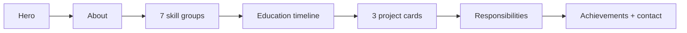

# Kunda Sriman — Developer Portfolio

Responsive single-page portfolio highlighting full-stack, cloud, AI/ML, and IoT
projects.


## Live preview

[Open the portfolio on GitHub Pages](https://sriman-kunda-056.github.io/portfolio.io/)

The site is a static root-level `index.html`, so it can be served directly by
GitHub Pages without a build pipeline.

## At a glance

| Verified page content | Count |
| --- | ---: |
| Major page sections | **8** |
| Technical skill groups | **7** |
| Project cards | **3** |
| Education entries | **3** |
| Positions of responsibility | **2** |
| Achievement cards | **2** |

## Page map



## Run locally

```bash
git clone https://github.com/Sriman-Kunda-056/portfolio.io.git
cd portfolio.io
python -m http.server 8000
```

Open <http://localhost:8000>.

## Technology

- Semantic HTML
- Tailwind CSS through the CDN
- Inline responsive styling
- GitHub Pages deployment

## Repository notes

- The working version keeps `index.html` at the repository root.
- The page currently depends on external Tailwind, Google Fonts, and placeholder
  image services.
- The mobile navigation is hidden on narrow screens and does not yet have a
  replacement menu.
- Contact details and the linked resume are intentionally public portfolio data.
